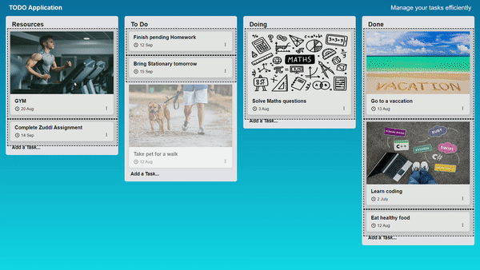

# TO DO Application

Zuddl Assignment 
## Introduction
TO DO application is a simple application where users can track and manage their tasks efficiently. It is a single page application. It is built using React framework and Redux for state management. It also has a drag and drop feature for rearranging the tasks.

## Features
- Users can create, edit and delete Tasks.
- Each task belongs to a board.
- Available boards are :- Resources,TO DO, Doing and Done.
- Users can rearrange tasks by drag and drop inside the board.
- Users can rearrange tasks by drag and drop between boards.

## Questions
- If a user can create and edit stages for a particular board. For example instead of Open > In Progress > Done if they want the stages of their task board to be Read > Working > Reviewing > Completed.
- If users can comment on tasks.
- How will you do error handling?

## Answers

- In order to achieve this, we can create an end point for editing the board stages. We can also create a UI(form) for the same similar to Edit task form and call that end point. All the tasks in the table with that board will be updated with the new stages.
- In order to achieve this, we can create a new end point for adding comments to a task. We can create a new comments table where we can store comments, commentID and PostID referencing to the Post in post table. Similarly for deleting a comment we can search for the commentID and delete it from the comments table.
- We can do the following things for error handling
    - We can use try catch blocks for handling errors.
    - We can create a new end point for logging errors. We can pass the error message and the error to the end point.
    - We can create special components that catch JS errors during rendering and display it to user.
    

## How to use
`npm install`
 
`npm start`

## Dependencies Used
- React framework
- Redux for state management
- react-dnd, react-dnd-html5-backend for Drag and Drop Feature
- react-icons for icons

## Screenshots

## Deployment
- Link : https://to-do-fajj.onrender.com
- Deployed on Render

